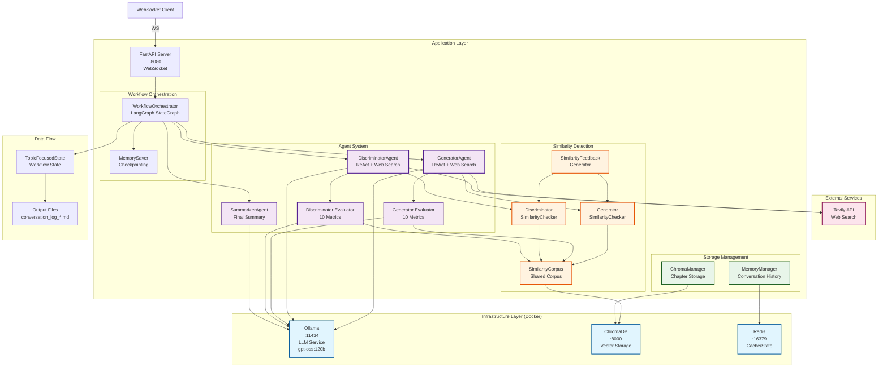
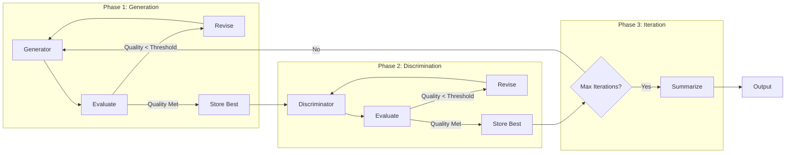
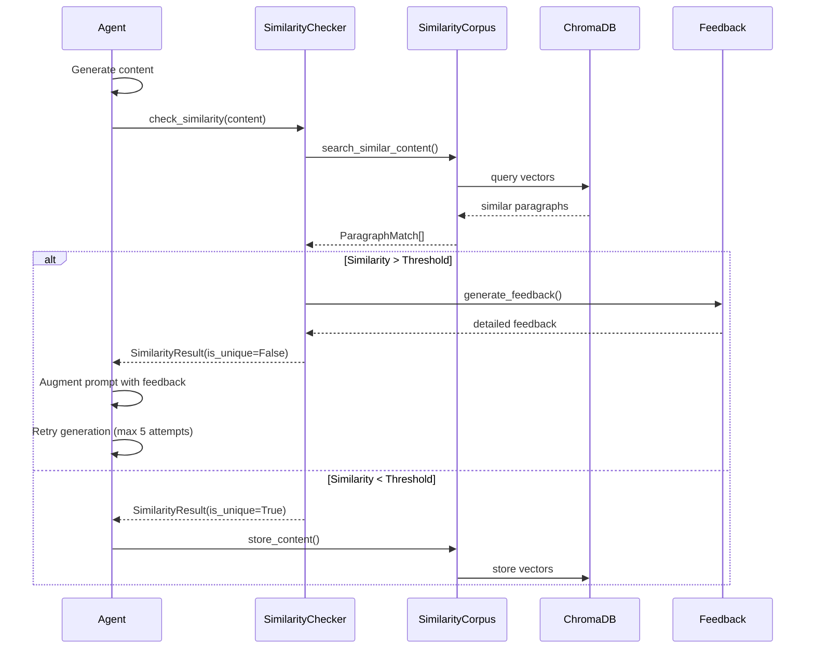

# Musequill v13

AI-powered creative writing system that orchestrates multiple specialized agents to generate long-form narrative content with similarity detection to prevent repetition.

## Architecture Overview



## Workflow Phases



## Similarity Detection Flow



## Key Components

### Infrastructure Services

- **Ollama** (port 11434): LLM service running gpt-oss:120b model with GPU support
- **ChromaDB** (port 8000): Vector database for similarity search and chapter storage
- **Redis** (port 16379): Cache and temporary state management

### Core Agents

1. **GeneratorAgent**: ReAct agent with Tavily web search for research-driven content creation
2. **DiscriminatorAgent**: Challenges and deepens the generator's content
3. **EvaluatorAgent**: Sophisticated evaluation using 10 metrics with domain-specific profiles
4. **SummarizerAgent**: Creates final summary of conversation

### Similarity Detection System

- **SimilarityCorpus**: Shared corpus storing best revisions from all agents
- **SimilarityChecker**: Checks new content against corpus (threshold: 0.85)
- **SimilarityFeedback**: Generates actionable feedback for repetitive content
- **Paragraph-level chunking**: Granular similarity detection
- **Sliding window search**: Optimized for large corpus (>100 chunks)

### Evaluation Metrics

1. Conceptual Novelty Rate (CNR)
2. Claim Density
3. Mathematical Rigor Index (MRI)
4. Structural Compression Ratio (SCR)
5. Citation/Reference Metrics
6. Empirical Grounding Score
7. Structural Coherence
8. Notation Consistency
9. Figure/Table Utility
10. Theoretical Parsimony

## Installation

### Prerequisites

- Docker & Docker Compose
- NVIDIA GPU with CUDA support (for Ollama)
- Python 3.10+
- Tavily API key

### Setup

1. Clone the repository:
```bash
git clone <repository>
cd musequill.v13
```

2. Copy environment configuration:
```bash
cp .env.example .env
# Edit .env with your configurations
```

3. Start infrastructure services:
```bash
docker-compose up -d
```

4. Install Python dependencies:
```bash
pip install -r requirements.txt
```

5. Run the application:
```bash
python main.py
```

## Configuration

### Environment Variables

```bash
# Server
SERVER_HOST=localhost
SERVER_PORT=8080

# Models
GENERATOR_MODEL=gpt-oss:120b
DISCRIMINATOR_MODEL=gpt-oss:120b

# Evaluation
QUALITY_THRESHOLD=75.0
MAX_REFINEMENT_ITERATIONS=3

# Similarity Detection
SIMILARITY_THRESHOLD=0.85
SIMILARITY_RELAXED_THRESHOLD=0.90
MAX_SIMILARITY_ATTEMPTS=5
PARAGRAPH_MIN_LENGTH=50
SLIDING_WINDOW_SIZE=3
SLIDING_WINDOW_ACTIVATION_THRESHOLD=100

# External Services
TAVILY_API_KEY=your_api_key
OLLAMA_BASE_URL=http://localhost:11434
CHROMA_HOST=localhost
CHROMA_PORT=8000
REDIS_URL=redis://localhost:16379
```

## Usage

### WebSocket API

Connect to `ws://localhost:8080/ws` and send:

```json
{
  "type": "content_request",
  "data": {
    "topic": "Your topic here",
    "max_iterations": 3
  },
  "workflow": "orchestrator"
}
```

### Testing Similarity Detection

Run the test script:
```bash
python test_similarity.py
```

## Development

### Project Structure

```
musequill.v13/
├── src/
│   ├── agents/           # Agent implementations
│   ├── common/           # Shared data structures
│   ├── exceptions/       # Custom exceptions
│   ├── llm/             # LLM client wrapper
│   ├── prompts/         # Agent prompts
│   ├── server/          # FastAPI server
│   ├── states/          # Workflow states
│   ├── storage/         # Storage managers
│   ├── utils/           # Utility functions
│   └── workflow/        # Orchestration logic
├── outputs/             # Generated content
├── docker-compose.yml   # Infrastructure services
├── main.py             # Application entry point
└── test_similarity.py  # Similarity testing
```

### Adding New Agents

1. Extend `BaseAgent` class
2. Implement `process()` method
3. Add similarity checking if generating content
4. Register in orchestrator workflow

### Monitoring

- Server logs: `http://localhost:8080/health`
- ChromaDB: `http://localhost:8000/api/v1/heartbeat`
- Ollama: `http://localhost:11434/api/tags`
- Redis: `redis-cli -p 16379 ping`

## License

[Your License Here]

## Contributing

[Contributing guidelines]